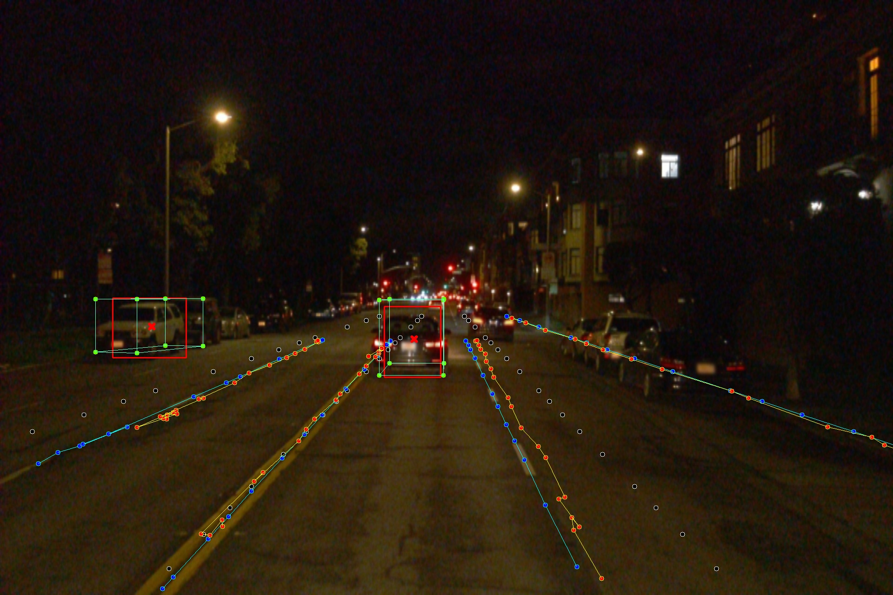
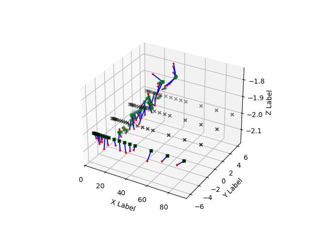

# MonoDLE-M

Engineered and modernized monodle, a universal framework for monocular 3D inspection



# Functional improvement

* [ ] FSDP
* [X] AMP
* [X] modle info(torch info)
* [ ] ~~Live Progress~~
* [X] loguru
* [ ] more optimitzer
* [X] torch2 support
* [X] torch.compile support
* [ ] torchopt support (SGD)
* [ ] CIOU loss
* [X] swanlab
* [ ] tensorboard
* [X] Anchor3DLine
* [X] MixUP3D(MonoLSS)
* [X] memory format (last channel)

# Environment

```
pip install -r requirements.txt
```

# Evaluate

Under construction

# Acknowlegment

This repo benefits from the excellent work [CenterNet](https://github.com/xingyizhou/CenterNet). Please also consider citing it.

# Citation

If you find our work useful in your research, please consider citing:

```latex
@InProceedings{Ma_2021_CVPR,
author = {Ma, Xinzhu and Zhang, Yinmin, and Xu, Dan and Zhou, Dongzhan and Yi, Shuai and Li, Haojie and Ouyang, Wanli},
title = {Delving into Localization Errors for Monocular 3D Object Detection},
booktitle = {Proceedings of the IEEE/CVF Conference on Computer Vision and Pattern Recognition (CVPR)},
month = {June},
year = {2021}}
```
